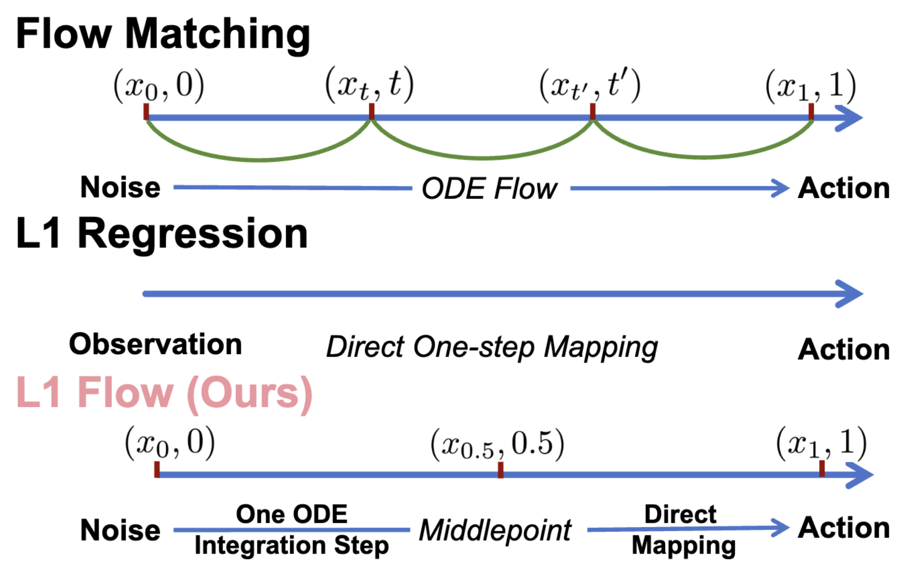
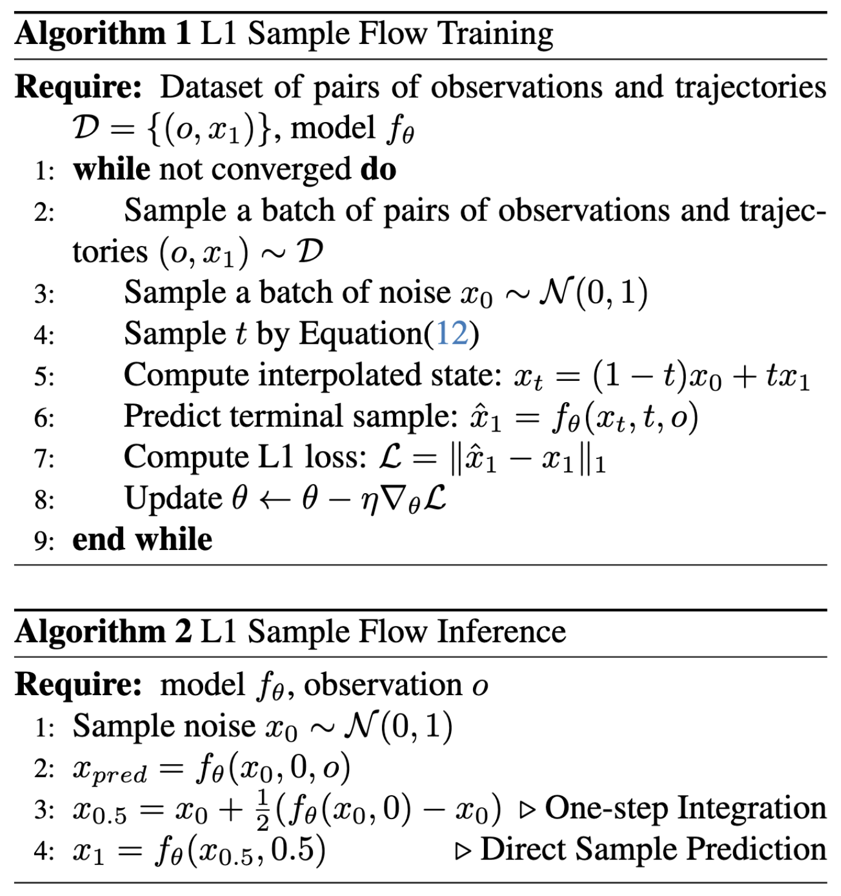

# L1Flow: L1 Sample Flow for Efficient Visuomotor Learning

[[Project page]](https://song-wx.github.io/l1flow.github.io/)
[[Paper]](https://arxiv.org/pdf/2511.17898)
[[Dataset]](https://diffusion-policy.cs.columbia.edu/data/training/)

[Weixi Song](https://scholar.google.com/citations?user=fvP8SGcAAAAJ)<sup>1,2,3</sup>,
[Zhetao Chen](https://scholar.google.com/citations?hl=zh-CN&user=1r_iQ9YAAAAJ)<sup>1,2</sup>,
[Tao Xu](https://openreview.net/profile?id=~Tao_Xu19)<sup>2</sup>,
[Xianchao Zeng](https://openreview.net/profile?id=~Xianchao_Zeng1)<sup>2</sup>,
[Xinyu Zhou](https://openreview.net/profile?id=~Xinyu_Zhou13)<sup>2</sup>,
[Lixin Yang](https://scholar.google.com/citations?user=Bm8p4JsAAAAJ)<sup>2,4</sup>,
[Donglin Wang](https://scholar.google.com/citations?user=-fo6wdwAAAAJ)<sup>3†</sup>,
[Cewu Lu](https://scholar.google.com/citations?user=QZVQEWAAAAAJ)<sup>2,4</sup>,
[Yonglu Li](https://scholar.google.com/citations?user=UExAaVgAAAAJ)<sup>2,4†</sup>

<sup>1</sup>Zhejiang University,
<sup>2</sup>Shanghai Innovation Institute,
<sup>3</sup>Westlake University,
<sup>4</sup>Shanghai Jiao Tong University

<sup>†</sup>Corresponding Author




## 🛠️ Installation

### 🖥️ Simulation

To reproduce our simulation benchmark results, install our conda environment on a Linux machine with Nvidia GPU. First, you should install the following apt packages for `mujoco`:

```console
sudo apt install -y libosmesa6-dev libgl1-mesa-glx libglfw3 patchelf
```

Then you can use `conda` or `mamba` as the package manager to create the environment:

```console
conda env create -f yamls/environment.yaml
```

This will create a conda environment named `robodiff`, which is mainly derived from [diffusion_policy](https://github.com/real-stanford/diffusion_policy).

**Attention**: Do not upgrade the package version arbitrarily, as the code strongly depends on `gym==0.21.0`

### 🦾 Real Robot

## 🖥️ Training on Robomimic Benchmark

### Download Training Data

Under the repo root, create data subdirectory and download the corresponding zip file from [https://diffusion-policy.cs.columbia.edu/data/training/](https://diffusion-policy.cs.columbia.edu/data/training/).  
You can run `python script/download.py` to automate all steps, or execute them manually:

```console
[diffusion_policy]$ mkdir data && cd data
[data]$ wget https://diffusion-policy.cs.columbia.edu/data/training/pusht.zip
[data]$ wget https://diffusion-policy.cs.columbia.edu/data/training/robomimic_image.zip
[data]$ unzip pusht.zip
[data]$ unzip robomimic_image.zip
```

### Train Single Task

Activate conda environment and login to [wandb](https://wandb.ai) (if you haven't already).

```console
conda activate robodiff
wandb login
```

Launch training with seed 42 on GPU 0.

```console
(robodiff)[diffusion_policy]$ python script/train.py --config-dir=./yamls --config-name=pusht_flow training.device=cuda:0 hydra.run.dir=results/EXP1/pusht/run_0 logging.name=pusht1_L1Flow_0 policy.infer_strategy=L1Flow policy.num_inference_steps=2 policy.t_first=0.5 policy.loss_type=l1 policy.loss_space=sample policy.timestep_sampler_type=mixed task.env_runner.n_test=100 training.num_epochs=200 optimizer.lr=1e-4 policy._target_=diffusion_policy.policy.L1Flow_unet_hybrid_image_policy.L1FlowUnetHybridImagePolicy
```

This will create a directory in format `data/outputs/yyyy.mm.dd/hh.mm.ss_<method_name>_<task_name>` where configs, logs and checkpoints are written to. The policy will be evaluated every 50 epochs with the success rate logged as `test/mean_score` on wandb, as well as videos for some rollouts.

```console
(robodiff)[diffusion_policy]$ tree data/outputs/2023.03.01/20.02.03_train_diffusion_unet_hybrid_pusht_image -I wandb
data/outputs/2023.03.01/20.02.03_train_diffusion_unet_hybrid_pusht_image
├── checkpoints
│   ├── epoch=0000-test_mean_score=0.134.ckpt
│   └── latest.ckpt
├── .hydra
│   ├── config.yaml
│   ├── hydra.yaml
│   └── overrides.yaml
├── logs.json.txt
├── media
│   ├── 2k5u6wli.mp4
│   ├── 2kvovxms.mp4
│   ├── 2pxd9f6b.mp4
│   ├── 2q5gjt5f.mp4
│   ├── 2sawbf6m.mp4
│   └── 538ubl79.mp4
└── train.log

3 directories, 13 files
```

### Generate Multi-task

### Evaluate Pre-trained Checkpoints

Download a checkpoint from the published training log folders, such as [https://diffusion-policy.cs.columbia.edu/data/experiments/low_dim/pusht/diffusion_policy_cnn/train_0/checkpoints/epoch=0550-test_mean_score=0.969.ckpt](https://diffusion-policy.cs.columbia.edu/data/experiments/low_dim/pusht/diffusion_policy_cnn/train_0/checkpoints/epoch=0550-test_mean_score=0.969.ckpt).

Run the evaluation script:

```console
(robodiff)[diffusion_policy]$ python eval.py --checkpoint data/0550-test_mean_score=0.969.ckpt --output_dir data/pusht_eval_output --device cuda:0
```

This will generate the following directory structure:

```console
(robodiff)[diffusion_policy]$ tree data/pusht_eval_output
data/pusht_eval_output
├── eval_log.json
└── media
    ├── 1fxtno84.mp4
    ├── 224l7jqd.mp4
    ├── 2fo4btlf.mp4
    ├── 2in4cn7a.mp4
    ├── 34b3o2qq.mp4
    └── 3p7jqn32.mp4

1 directory, 7 files
```

`eval_log.json` contains metrics that is logged to wandb during training:

```console
(robodiff)[diffusion_policy]$ cat data/pusht_eval_output/eval_log.json
{
  "test/mean_score": 0.9150393806777066,
  "test/sim_max_reward_4300000": 1.0,
  "test/sim_max_reward_4300001": 0.9872969750774386,
...
  "train/sim_video_1": "data/pusht_eval_output//media/2fo4btlf.mp4"
}
```

## 🦾 Demo, Training and Eval on a Real Robot

Make sure your UR5 robot is running and accepting command from its network interface (emergency stop button within reach at all time), your RealSense cameras plugged in to your workstation (tested with `realsense-viewer`) and your SpaceMouse connected with the `spacenavd` daemon running (verify with `systemctl status spacenavd`).

Start the demonstration collection script. Press "C" to start recording. Use SpaceMouse to move the robot. Press "S" to stop recording.

```console
(robodiff)[diffusion_policy]$ python demo_real_robot.py -o data/demo_pusht_real --robot_ip 192.168.0.204
```

This should result in a demonstration dataset in `data/demo_pusht_real` with in the same structure as our example [real Push-T training dataset](https://diffusion-policy.cs.columbia.edu/data/training/pusht_real.zip).

To train a Diffusion Policy, launch training with config:

```console
(robodiff)[diffusion_policy]$ python train.py --config-name=train_diffusion_unet_real_image_workspace task.dataset_path=data/demo_pusht_real
```

Edit [`diffusion_policy/config/task/real_pusht_image.yaml`](./diffusion_policy/config/task/real_pusht_image.yaml) if your camera setup is different.

Assuming the training has finished and you have a checkpoint at `data/outputs/blah/checkpoints/latest.ckpt`, launch the evaluation script with:

```console
python eval_real_robot.py -i data/outputs/blah/checkpoints/latest.ckpt -o data/eval_pusht_real --robot_ip 192.168.0.204
```

Press "C" to start evaluation (handing control over to the policy). Press "S" to stop the current episode.

## 🗺️ Codebase Tutorial

You can find a detailed codebase tutorial in [TUTORIAL.md](TUTORIAL.md) to help you understand the implementation details.

## 🏷️ License

This repository is released under the MIT license. See [LICENSE](LICENSE) for additional details.

## 🙏 Acknowledgement

This code is mainly derived from [diffusion_policy](https://github.com/real-stanford/diffusion_policy), and we have made a series of modifications to adapt our algorithm and make it more user-friendly. We sincerely thank the authors for their excellent work.

Below is the original acknowledgement:

-   Our [`ConditionalUnet1D`](./diffusion_policy/model/diffusion/conditional_unet1d.py) implementation is adapted from [Planning with Diffusion](https://github.com/jannerm/diffuser).
-   Our [`TransformerForDiffusion`](./diffusion_policy/model/diffusion/transformer_for_diffusion.py) implementation is adapted from [MinGPT](https://github.com/karpathy/minGPT).
-   The [BET](./diffusion_policy/model/bet) baseline is adapted from [its original repo](https://github.com/notmahi/bet).
-   The [IBC](./diffusion_policy/policy/ibc_dfo_lowdim_policy.py) baseline is adapted from [Kevin Zakka's reimplementation](https://github.com/kevinzakka/ibc).
-   The [Robomimic](https://github.com/ARISE-Initiative/robomimic) tasks and [`ObservationEncoder`](https://github.com/ARISE-Initiative/robomimic/blob/master/robomimic/models/obs_nets.py) are used extensively in this project.
-   The [Push-T](./diffusion_policy/env/pusht) task is adapted from [IBC](https://github.com/google-research/ibc).
-   The [Block Pushing](./diffusion_policy/env/block_pushing) task is adapted from [BET](https://github.com/notmahi/bet) and [IBC](https://github.com/google-research/ibc).
-   The [Kitchen](./diffusion_policy/env/kitchen) task is adapted from [BET](https://github.com/notmahi/bet) and [Relay Policy Learning](https://github.com/google-research/relay-policy-learning).
-   Our [shared_memory](./diffusion_policy/shared_memory) data structures are heavily inspired by [shared-ndarray2](https://gitlab.com/osu-nrsg/shared-ndarray2).
